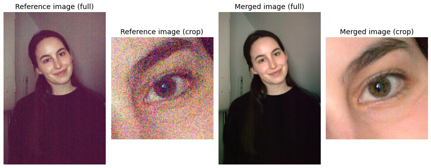

# HDR+ PyTorch

[](https://colab.research.google.com/github/martin-marek/hdr-plus-pytorch/blob/main/demo.ipynb)

This is a simplified PyTorch implementation of HDR+, the backbone of computational photography in Google Pixel phones, described in [Burst photography for high dynamic range and low-light imaging on mobile cameras](http://static.googleusercontent.com/media/www.hdrplusdata.org/en//hdrplus.pdf).

Using a free Colab GPU, aligning 35 20MP raw images takes roughly 13 seconds.
 
# Example

I took a burst of 35 images at ISO 12,800 on Sony RX100-V and boosted it by +2EV. Here's a comparison of a [single image](https://github.com/martin-marek/hdr-plus-pytorch/raw/main/illustrations/burst_sample.jpg) from the burst vs. a [merge of all the images](https://github.com/martin-marek/hdr-plus-pytorch/raw/main/illustrations/merged_image.jpg).
 


# Usage

Here's a minimal example to align and merge a burst of raw images. For more, see the [Colab Notebook](https://colab.research.google.com/github/martin-marek/hdr-plus-pytorch/blob/main/demo.ipynb).

```python
import torch, align
images = torch.zeros([5, 1, 1000, 1000])
merged_image = align.align_and_merge(images)
```

# Implementation details

The core of my implementation is stacking all tile displacements along the batch dimension and performing comparisons with the help of broadcasting. I've illustrated this for the simplest case of 9 displacements of a 5x5 tile. In reality, the number of tiles and displacements is large. I've annotated the shape of most tensors in my code, so that it's easy to see what's going on in every line.


# Features
- [x] jpeg support
- [x] RAW support
- [x] simple merge
- [ ] robust merge
- [x] tile comparison in pixel space
- [ ] tile comparison in Fourier space
- [x] CUDA support
- [x] CPU support (very slow)
- [ ] color post-processing
- [ ] automatic selection of the reference image
